# 2017-2020

| Model          | Year of Release | Developer   | Architecture      | Number of Parameters   |
|----------------|----------------|-------------|-------------------|------------------------|
| Transformer    | 2017           | Google      | Encoder-Decoder   | -                      |
| GPT-1          | 2018           | OpenAI      | Decoder           | 117 million             |
| BERT           | 2018           | Google      | Encoder           | 110 million - 340 million    |
| ALBERT         | 2019           | Google      | Encoder           | 11 million - 1.5 billion     |
| BART           | 2019           | Facebook    | Encoder-Decoder   | 406 million - 1.4 billion     |
| GPT-2          | 2019           | OpenAI      | Decoder           | 1.5 billion            |
| RoBERTa        | 2019           | Facebook    | Encoder           | 125 million - 355 million |
| UniLM          | 2019           | Microsoft   | Encoder-Decoder   | 340 million            |
| XLM            | 2019           | Facebook    | Encoder           | 270 million - 1.5 billion |
| XLNet          | 2019           | Google      | Transformer-XL    | 340 million            |
| GPT-3          | 2020           | OpenAI      | Decoder           | 175 billion            |
| Reformer       | 2020           | Google      | Reformer          | 85 million - 1.6 billion |
| T5             | 2020           | Google      | Encoder-Decoder   | 220 million - 11 billion |

## 2017: Transformer
Google  
Vaswani, A., Shazeer, N., Parmar, N., Uszkoreit, J., Jones, L., Gomez, A. N., ... & Polosukhin, I. (2017). Attention is all you need. Advances in neural information processing systems, 30.

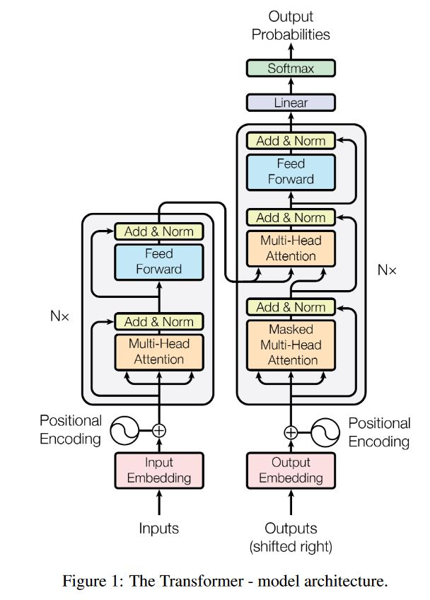

## 2018: GPT-1
OpenAI  
Radford, A., Narasimhan, K., Salimans, T., & Sutskever, I. (2018). Improving language understanding by generative pre-training.

**Highlights**  
- High performance using generative pre-training language models on a diverse corpus of unlabeled text + fine-tuning on each NLP task
- task-aware input transformations during fine-tuning to achieve effective transfer while requiring minimal changes to the model architecture
- The general task-agnostic model outperforms models with specific architectures for each task
- significantly improved upon the state of the art in 9 out of the 12 tasks studied
- in the original transformer, the decoder was used in the context of sequence-to-sequence tasks but GPT-1 is designed for language modeling tasks. The architecture of the decoder in GPT-1 is adapted with some modifications such as a unidirectional self-attention mechanism.

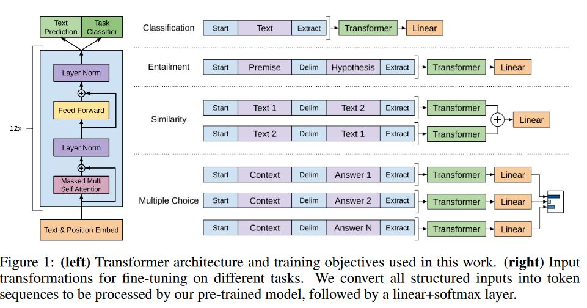

## 2018: BERT
Google  
Devlin, J., Chang, M. W., Lee, K., & Toutanova, K. (2018). Bert: Pre-training of deep bidirectional transformers for language understanding. arXiv preprint arXiv:1810.04805.

**Highlights**  
- Stands for Bidirectional Encoder Representations from Transformers
- designed to pre-train deep bidirectional representations from unlabeled text by jointly conditioning on both left and right context in all layers
- fine-tuned with only one additional output layer without substantial task-specific architecture modifications
- obtains new state-of-the-art results on eleven natural language processing tasks 
- The paper provides 3 calsses of solutions to NLP problem:
    - Unsupervised Feature-based Approaches (such as Word2Vec, GloVe)
    - Unsupervised Fine-tuning Approaches (such as BERT and GPT)
    - Transfer Learning from Supervised Data

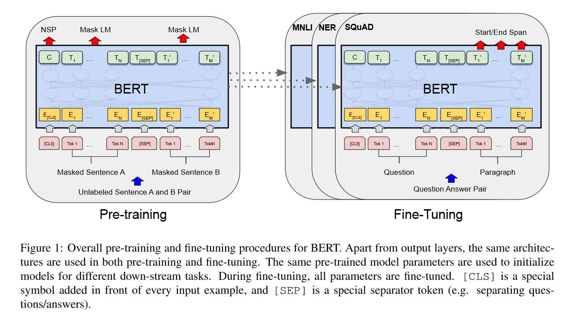
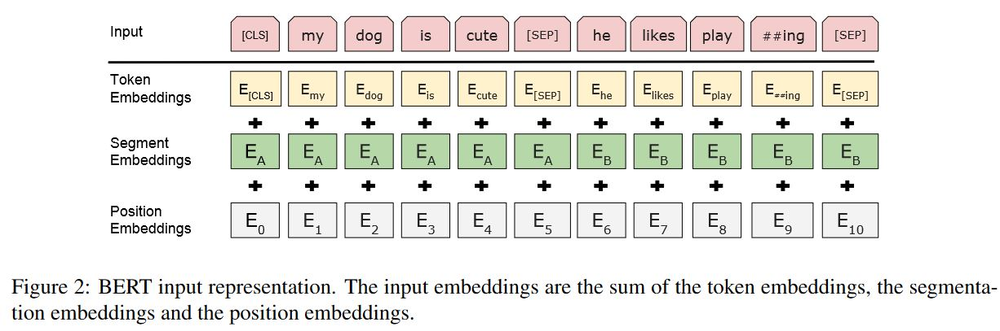

## 2019: Albert 
Google-Toyota  
Lan, Z., Chen, M., Goodman, S., Gimpel, K., Sharma, P., & Soricut, R. (2019). Albert: A lite bert for self-supervised learning of language representations. arXiv preprint arXiv:1909.11942.

**Highlights**  
- presented two parameter-reduction techniques to lower memory consumption and increase the training speed of BERT. 
- Used a self-supervised loss that focuses on modeling inter-sentence coherence, and show it consistently helps downstream tasks with multi-sentence inputs. 
- Eestablished new state-of-the-art results while having fewer parameters compared to BERT-large

## 2019: BART
Facebook  
Lewis, M., Liu, Y., Goyal, N., Ghazvininejad, M., Mohamed, A., Levy, O., ... & Zettlemoyer, L. (2019). Bart: Denoising sequence-to-sequence pre-training for natural language generation, translation, and comprehension. arXiv preprint arXiv:1910.13461.

**Highlights**  
- presented BART a denoising autoencoder for pretraining seq2seq models
- stands for Bidirectional and Auto-Regressive Transformer
- BART is trained by (1) corrupting text with an arbitrary noising function, and (2) learning a model to reconstruct the original text. 
- uses a standard Tranformer-based neural machine translation architecture which, despite its simplicity.
- can be seen as generalizing BERT (due to the bidirectional encoder), GPT (with the left-to-right decoder), and many other more recent pretraining schemes 
- evaluated noising approaches, finding the best performance by both randomly shuffling the order of the original sentences and using a novel in-filling scheme, where spans of text are replaced with a single mask token. 
- BART is particularly effective when fine-tuned for text generation 
- matches the performance of RoBERTa with comparable training resources 

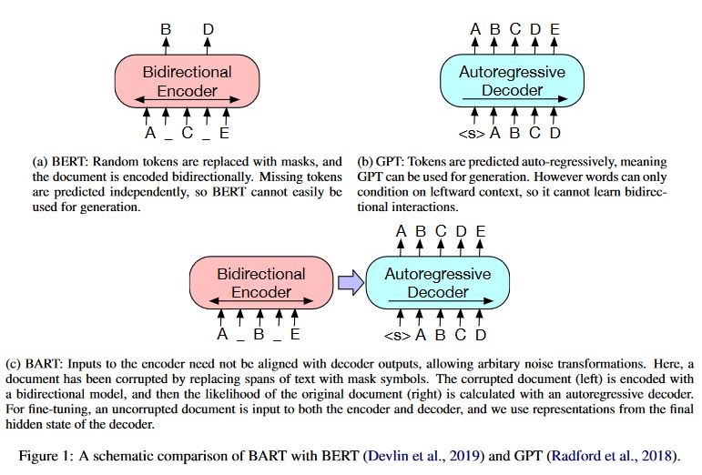
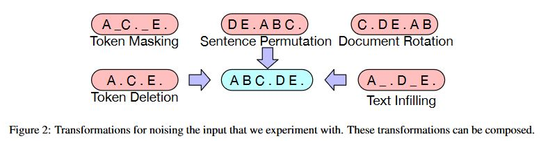
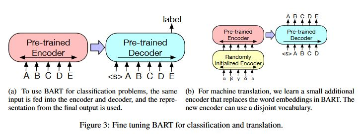

## 2019: GPT-2
OpenAI  
Radford, A., Wu, J., Child, R., Luan, D., Amodei, D., & Sutskever, I. (2019). Language models are unsupervised multitask learners. OpenAI blog, 1(8), 9.

**Highlights**  
- We demonstrate that language models learns NLP tasks without explicit supervision when trained on a new dataset of millions of webpages called WebText.
- When conditioned on a document plus questions, the model exceeding the performance without using training examples.
- The capacity of the language model is essential to the success of zero-shot task transfer and increasing it improves performance in a log-linear fashion across tasks. 
- GPT-2 (1.5B parameter) achieves state of the art results on 7 out of 8 tested language modeling datasets in a zero-shot setting but still underfits WebText. 
- These findings suggest a promising path towards building language processing systems which learn to perform tasks from their naturally occurring demonstrations. 
- Based on Byte Pair Encoding (BPE) for data representation (embedding)
- Model: slightly changed from GPT-1 (shown below)

## 2019: RoBERTa
Facebook  
Liu, Y., Ott, M., Goyal, N., Du, J., Joshi, M., Chen, D., Levy, O., Lewis, M., Zettlemoyer, L., & Stoyanov, V. (2019). RoBERTa: A Robustly Optimized BERT Pretraining Approach. arXiv preprint arXiv:1907.11692

**Highlights**  
- We present a replication study of BERT pretraining that carefully measures the impact of many key hyperparameters and training data size. 
- We find that BERT was significantly undertrained, and can match or exceed the performance of every model published after it. 
- Propose an improved recipe for training BERT models (RoBERTa), that can match or exceed the performance of all of the post-BERT methods
- Modifications: Our modifications are simple, they include: 
    - (1) training longer, with bigger batches, over more data; 
    - (2) removing the next sentence prediction objective; 
    - (3) training on longer sequences;
    - (4) dynamically changing the masking pattern applied to the training data. 

## 2019: UniLM
Microsoft  
Dong, L., Yang, N., Wang, W., Wei, F., Liu, X., Wang, Y., ... & Hon, H. W. (2019). Unified language model pre-training for natural language understanding and generation. Advances in neural information processing systems, 32.

**Highlights**  
- This paper presents a  Unified pre-trained Language Model (UniLM)
- The model is pre-trained using three types of language modeling tasks: unidirectional, bidirectional, and sequence-to-sequence prediction.
- Achieved by employing a shared Transformer and specific self-attention masks to control what context the prediction conditions on.

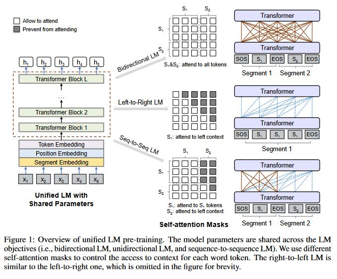

## 2019: XLM
Facebook  
Lample, G., & Conneau, A. (2019). Cross-lingual language model pretraining. arXiv preprint arXiv:1901.07291.
- We extend LLMs to multiple languages and show the effectiveness of cross-lingual pretraining. 
- We propose two methods to learn cross-lingual language models (XLMs): 
    - unsupervised that only relies on monolingual data
    - supervised that leverages parallel data with a new cross-lingual language model objective
. We obtain state-of-the-art results on cross-lingual classification, unsupervised and supervised machine translation. 

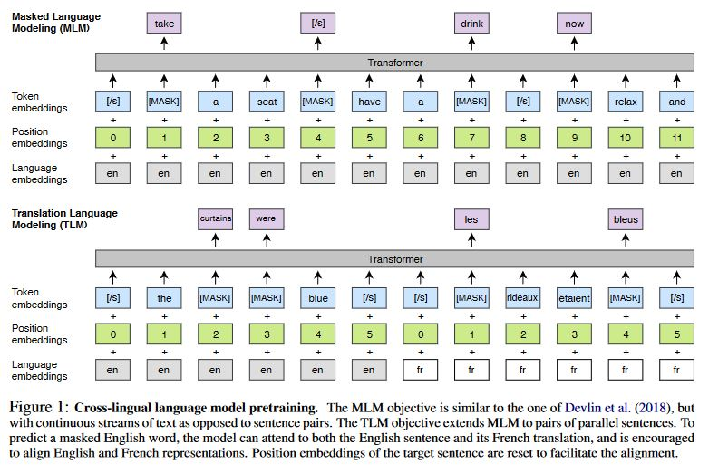

## 2019: XLNet
Carnegie Mellon University and Google  
Yang, Z., Dai, Z., Yang, Y., Carbonell, J. G., Salakhutdinov, R., & Le, Q. V. (2019). XLNet: Generalized Autoregressive Pretraining with Cross-attention for Natural Language Understanding. arXiv preprint arXiv:1901.07285.

**Highlights**  
- Relying on corrupting the input with masks, BERT neglects dependency between the masked positions and suffers from a pretrain-finetune discrepancy
- We proposse XLNet, a generalized autoregressive pretraining method that 
    - (1) enables learning bidirectional contexts by maximizing the expected likelihood over all permutations of the factorization order and 
    - (2) overcomes the limitations of BERT thanks to its autoregressive formulation. 

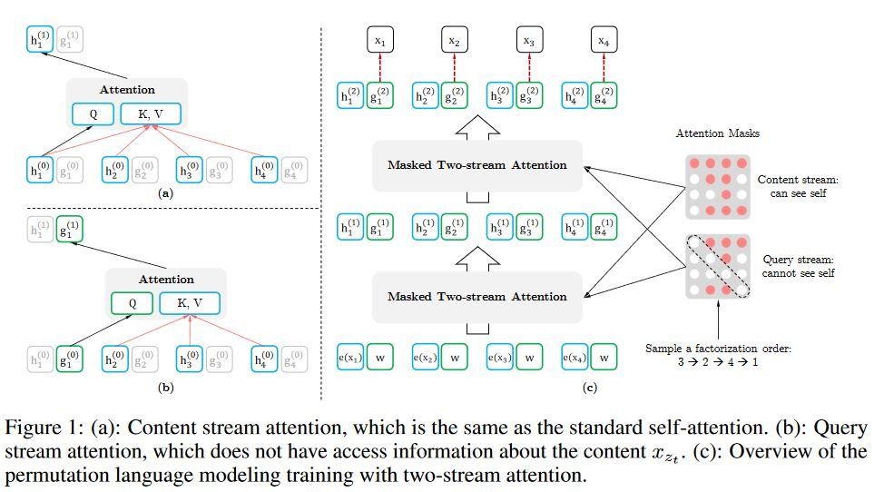

## 2020: GPT3
OpenAI  
Brown, T., Mann, B., Ryder, N., Subbiah, M., Kaplan, J. D., Dhariwal, P., ... & Amodei, D. (2020). Language models are few-shot learners. Advances in neural information processing systems, 33, 1877-1901.

**Highlights**  
- While LLMs are task-agnostic in architecture, it requires task-specific fine-tuning datasets
- By contrast, humans can generally perform a new language task from only a few examples or from simple instructions
- We show that scaling up language models greatly improves task-agnostic, few-shot performance
- we train GPT-3, an autoregressive language model with 175 billion parameters
- GPT-3 achieves strong performance on many NLP tasks 
- We also identify some datasets where GPT-3's few-shot learning still struggles, as well as some datasets where GPT-3 faces methodological issues related to training on large web corpora. 
- Finally, we find that GPT-3 can generate samples of news articles which human evaluators have difficulty distinguishing from articles written by humans. 
- Same architecture as GPT-2

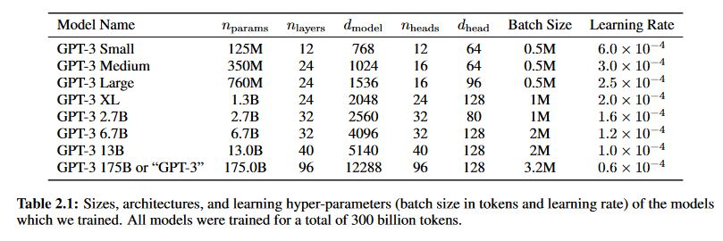

## 2020: Reformer
Google  
Kitaev, N., Kaiser, Ł., & Levskaya, A. (2020). Reformer: The efficient transformer. arXiv preprint arXiv:2001.04451.

**Highlights**  
- Large Transformer models training is prohibitively costly
- We introduce two techniques to improve the efficiency of Transformers:
    - we replace dot-product attention by one that uses locality-sensitive hashing, changing its complexity from O(L2) to O(LlogL)
    - we use reversible residual layers instead of the standard residuals, which allows storing activations only once in the training process instead of N times
- The resulting model, the Reformer, performs on par with Transformer models while being much more memory-efficient and much faster on long sequences. 

## 2020: T5
Google  
Raffel, C., Shazeer, N., Roberts, A., Lee, K., Narang, S., Matena, M., ... & Liu, P. J. (2020). Exploring the limits of transfer learning with a unified text-to-text transformer. The Journal of Machine Learning Research, 21(1), 5485-5551.

**Highlights**  
- Stands for Text-To-Text Transfer Transformer
- we explore the landscape of transfer learning techniques for NLP by introducing a unified framework that converts all text-based language problems into a text-to-text format. 
- By combining the insights from our exploration with scale and our new "Colossal Clean Crawled Corpus", we achieve state-of-the-art results on many benchmarks covering summarization, question answering, text classification, and more. 
- Still, a base model is trained and used for other downstream tasks. However, you can also train multitask models.
- The model is very similar to the 2017 Transformer (encoder-decoder)
- Controling the masking (prefix LM, looking at part of sentence first then masking)

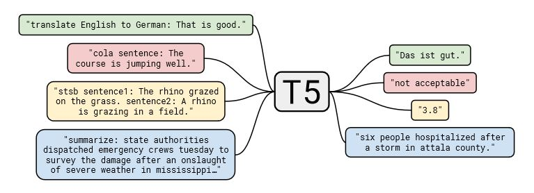

### Quick Recap (after Colin Raffel presentation)
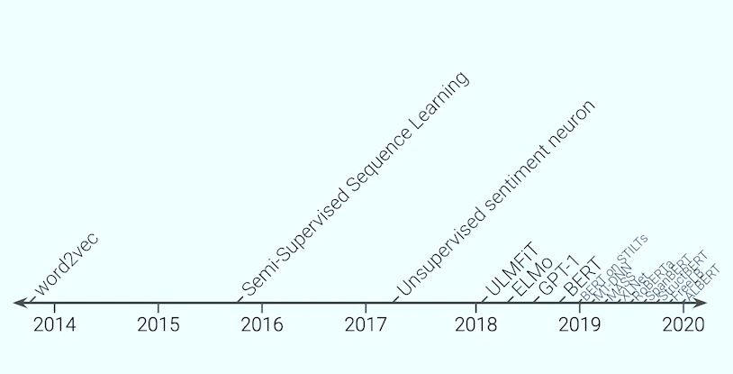
