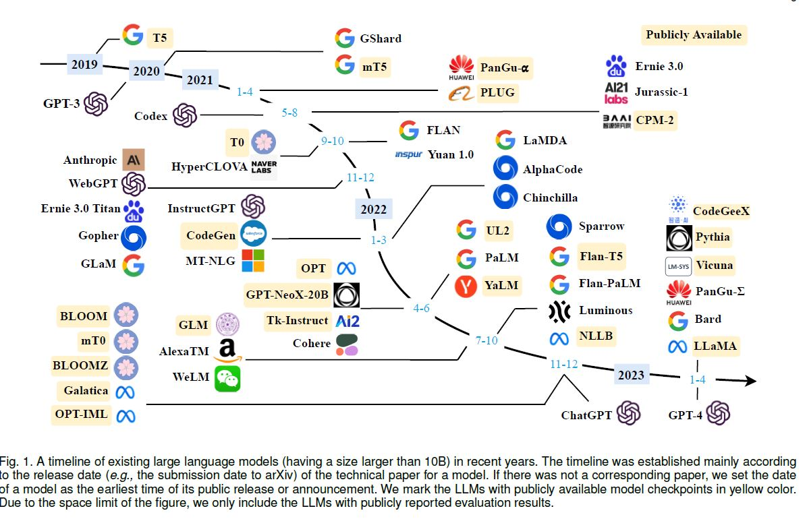
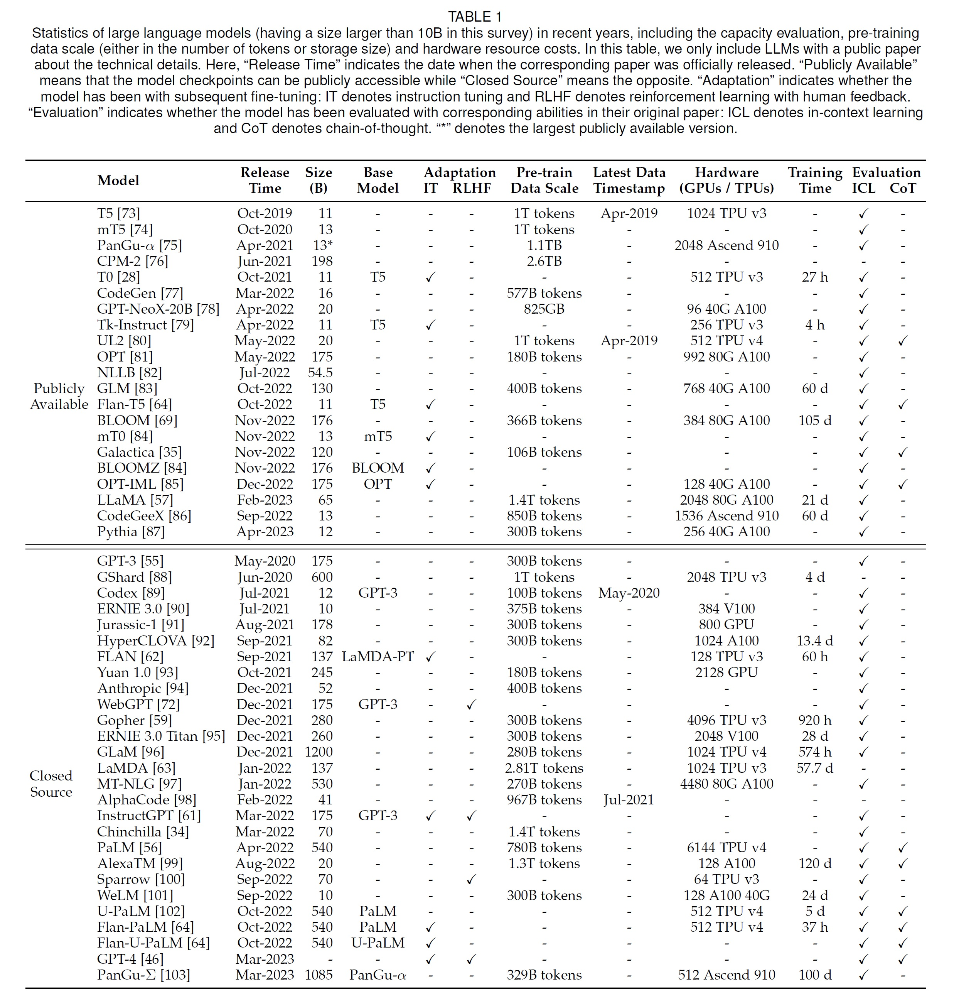
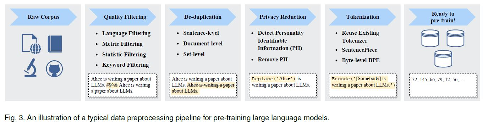
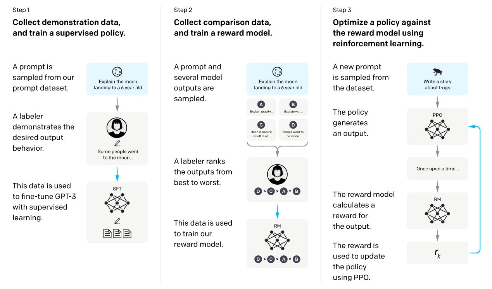

# A Survey of Large Language Models
> Wayne Xin Zhao, Kun Zhou, Junyi Li, Tianyi Tang, Xiaolei Wang, Yupeng Hou, Yingqian Min, Beichen Zhang, Junjie Zhang, Zican Dong, Yifan Du, Chen Yang, Yushuo Chen, Zhipeng Chen, Jinhao Jiang, Ruiyang Ren, Yifan Li, Xinyu Tang, Zikang Liu, Peiyu Liu, Jian-Yun Nie, Ji-Rong Wen

### Language Models
LMs aims to model the generative likelihood of word sequences so as to predict the probabilities of future (or missing) tokens.

- Statistical Language Models (SLM)
    - based on Markov assumptions
    - n-grams
    - suffer from curse of dimensionality

- Neural Language Models (NLM)
    - the idea of word embedding or representation
- Pre-trained Language Models (PLM)
    - ELMo (Embeddings from Language Models)
    - Transformers: pre-train and fine-tune paradigm
- Large Language Models (LLM)
    - scalled PLMs (model size and data size)
    - show supprizing abbilities (emergent abilities)

### Questions to Answer about LLMs
- Why emergent abilities occur?
- What happens to academia and research?
- Challanges to align LLMs with human values

### Overview
- Scaling Laws
- Emergent Abilities
    - **In-context Learning**: refers to the process of acquiring knowledge or skills through direct application and experience within a relevant and meaningful context or situation.
    - **Instruction Following**: refers to the ability of a language model to accurately execute a sequence of instructions or commands given in natural language.
    - **Step-by-Step Reasoning**: refers to the ability of a language model to generate structured and logical output by breaking down a complex problem into smaller, more manageable steps. Might be the impact of exposure to code. uses Chain of Thoughts (CoT) in prompting.

- Key Techniques
    - **Scalling**
    - **Training**: distributed algorithms such as DeepSpeed (microsoft) and Megatron-LM (nvidia)
    - **Ability Eliciting**: refers to the process of identifying and assessing the model's strengths and weaknesses in performing specific natural language processing tasks.
    - **Alignment Tuning**:
        - supervised fine-tunning on human demonstrations (the first step in RLHF) = instruciton tuning 
        - using reinforcement learning with human feedback (RLHF)
    - **Tools Manupulation**:
        - employ external tools in LLM tasks
        - act as _eyes and ears_ of LLMs

### Resources
- Transformers
- DeepSpeed
- Megatron-LM
- JAX
- Colossal-AI
- BMTrain
- FastMoE (mixture of experts)
- Alpa (a system for training and serving large-scale neural networks)

### Survy Structure
- Pre-Training
- Adaption Tuning (for effectiveness and safety)
- Utilization
- Capability/Capacity Evaluation

# Pre-Training

1. Data Collection and Processing
    - quality filtering
    - de-duplication
    - privacy reduction
    - tokenization
        - Byte Pair Encoding (BPE) ia popular option

2. Architecture
    - Main Stream Architectures
        - Encoder-Decoder
        - Causal Decoder (superior)
        - Prefix Decoder
    - Configurations
        - Normalization: Pre-RMS Norm for LN
        - Actication Function: SwiGLU or GeGLU
        - Position Embeddings: RoPE or AliBi
    - Pre-Training Tasks
        - Language Modeling
        - Denoising Autoencoding (corrupted text with randomly replaced spans)

3. Training
    - Optimization
        - batch training (~8k examples or 16M tokens)
            - GPT3: from 32K to 3.2M tokens (gradually)
        - Learning Rate: warm-up and decay strategies (0.1% to 0.5%)
        - Optimizer: Adam varients (Adam, AdamW, Adafactor)
        - Stablizing the training: weight decay, gradient clipping, restart
    - Scalable Techniques
        - 3D Parallelism: data, pipeline, tensor
        - ZeRO (used in DeepSpeed)
        - Mixed percision training (32bit in transformers to 16bit in LLMs)
        - GPT3 used "predictable scalling"
        - Pytorch: FSDP (fully standard data parallel)
    - In inference: quantization to reduce time and space (INT8 or 4)

# Adaption Tuning
1. Instruction Tuning (unlocks skills)
    - train the model in suppervised fashion seq-to-seq
    - important for multi-tasking and task generatlization
    - there are recommendations around format and data combinations
2. Alignment Tuninig (align the behaviour)
    - alignment might harm the general skills of the LLM
        - called "alignment tax"
    - e.g., three representative alignment critieria: helpful, honest, harmless
    - collecting human feedback
        - ranking-based 
        - question-based 
        - rule-base
    - Reinforcement Learning from Human (RLFH)
        - use a small scale LLM model as the reward model and train it with human data
            - add a penatly (tax) to keep the new model very similar to the original model
        - train a policy (LLM)
3. Efficient Training
    - general approaches:
        - adapter tuning 
        - prefix tuning 
        - prompt tuning
        - low-rank adaption
    - for LLMs:
        - LoRA (low-rank adaption)
        - Parameter-Efficient Fine-Tuning: PEFT (python library)

# Utilization

# Capability/Capacity Evaluation

